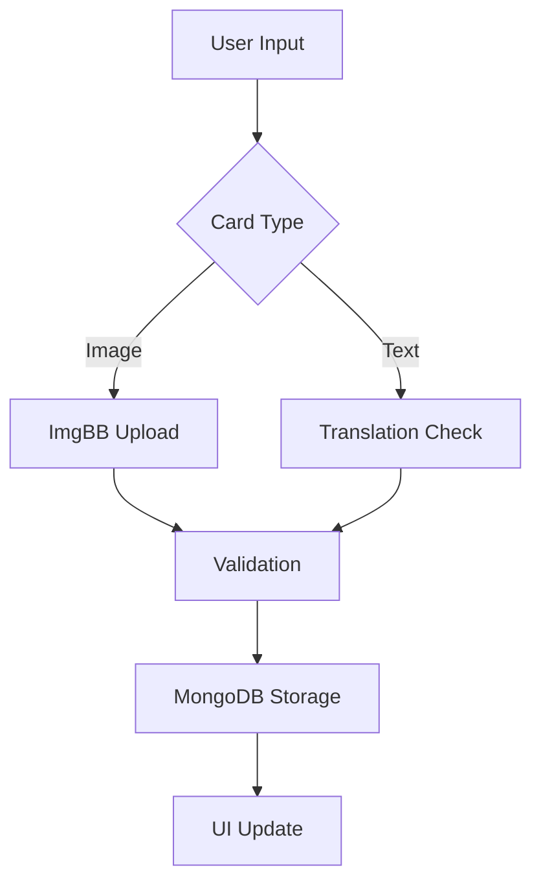
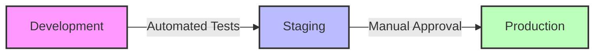

# System Architecture

## System Overview

NARIMATO is a Next.js application with TypeScript and Tailwind CSS, using MongoDB Atlas as its database. The architecture follows a modular approach with clear separation of concerns, emphasizing type safety, responsive design, and scalability.

## Component Hierarchy

### 1. Frontend Layer
```
/components
├── UI/                   # UI primitives
├── Card/                 # Card components
│   ├── Card.tsx         # Base card component with aspect ratio handling
│   ├── Container.tsx    # Responsive container with styling system
│   ├── ImageCard.tsx    # Image-specific card implementation
│   ├── TextCard.tsx     # Text card with translation support
│   └── Controller.tsx   # Touch & keyboard interaction handling
└── Common/              # Shared components
```

### 2. Page Structure
```
/pages
├── index.tsx            # Enhanced homepage design
├── _app.tsx             # Application wrapper with providers
├── card/
│   ├── [slug].tsx       # Individual card view/edit
│   ├── create.tsx       # Card creation interface
│   └── list.tsx         # Card listing with filters
├── project/[slug].tsx   # Project management
├── swipe.tsx            # Card swiping interface
├── vote.tsx             # Head-to-head voting
├── leaderboard.tsx      # Global rankings
└── dashboard.tsx        # Admin interface
```

### 3. Data & Utils Layer
```
/utils
├── db/
│   ├── connect.ts       # MongoDB connection handler
│   └── models/          # Mongoose models & schemas
├── validation/
│   ├── card.ts          # Zod schemas for card data
│   └── project.ts       # Project validation schemas
├── services/
│   ├── imgbb.ts         # Image upload service
│   ├── elo.ts           # Rating calculations
│   └── ranking.ts       # Sorting algorithms
└── helpers/            # Utility functions
```

## Data Flow & Integration

### Card Processing Flow


### Key Features

### Card System v1.0.0
- Enhanced Card Components:
  - Image Cards: Original aspect ratio preservation
  - Text Cards: Fixed 3:4 ratio with dynamic resizing
  - Container-based styling system
  - Hashtag support and filtering
  - Translation support for text cards

### Image Processing
- ImgBB Integration:
  - Secure upload handling
  - File validation (32MB limit)
  - Supported formats: JPG, PNG, GIF, TIF, WEBP, HEIC, AVIF, PDF

### User System
- TypeScript-based session management
- UUID-based identity system
- Role-based access control (RBAC)
- Enhanced admin dashboard

### Real-time Features
- Socket.io integration
- Live updates for card changes
- Real-time leaderboard updates
- Activity broadcasting

## Technical Specifications

### Security Architecture
- Session-based authentication with TypeScript types
- Role-based access control (RBAC)
- Protected admin endpoints and API routes
- Rate limiting per IP/user

### Data Validation & Safety
- Comprehensive Zod schema validation
- Type-safe input handling
- Strict input sanitation
- File type verification

## Database Architecture

### Card Collection
```typescript
interface Card {
  type: 'image' | 'text';
  content: string;          // URL for images, text content for text cards
  hashtags: string[];       // Indexed for efficient filtering
  translations?: {
    [locale: string]: {
      content: string;
      lastUpdated: Date;
    }
  };
  metadata: {
    dimensions?: {
      width: number;
      height: number;
    };
    fileSize?: number;      // For images only
    format?: string;        // File format for images
  };
  slug: string;             // URL-friendly unique identifier
  status: 'active' | 'archived' | 'deleted';
  createdAt: Date;
  updatedAt: Date;
}
```

### Project Collection
```typescript
interface Project {
  name: string;
  description: string;
  cards: ObjectId[];        // References to Card collection
  settings: {
    visibility: 'public' | 'private';
    allowComments: boolean;
    cardOrder: 'manual' | 'date' | 'popularity';
  };
  createdAt: Date;
  updatedAt: Date;
}
```

### User Collection
```typescript
interface User {
  uuid: string;              // Unique identifier
  role: 'admin' | 'user' | 'guest';
  preferences: {
    darkMode: boolean;
    language: string;
    notifications: {
      email: boolean;
      push: boolean;
    };
  };
  lastActive: Date;
  createdAt: Date;
  updatedAt: Date;
}
```

## Deployment & DevOps

### Environment Structure


### CI/CD Pipeline v1.0.0
- Vercel-based deployment automation
- Environment-specific configurations
- TypeScript type checking
- Automated testing pipeline
- Database migration management
- Performance monitoring

### Performance Optimization
- Static page generation where possible
- Image optimization pipeline
- MongoDB query optimization
- Client-side caching strategy
