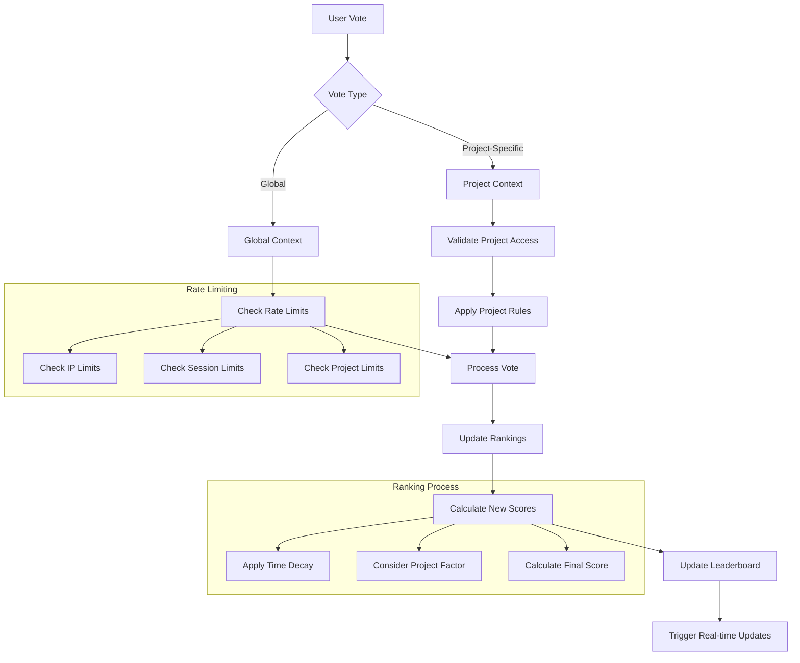
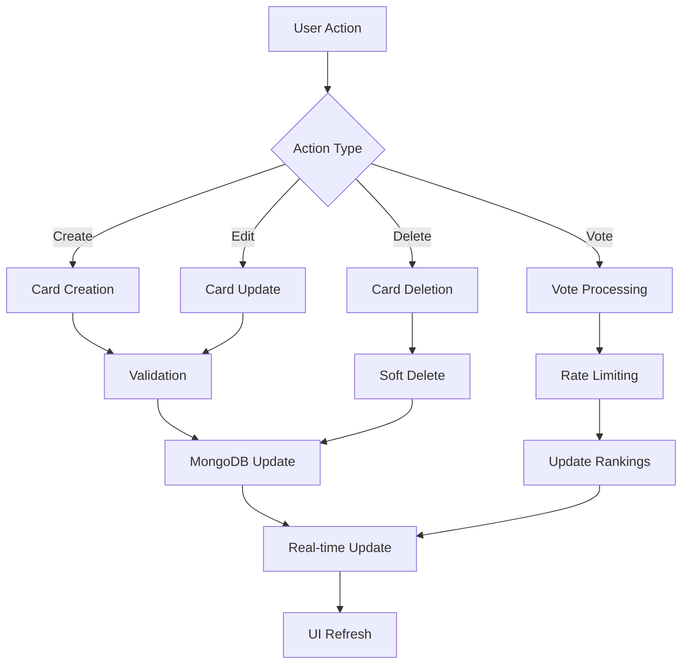
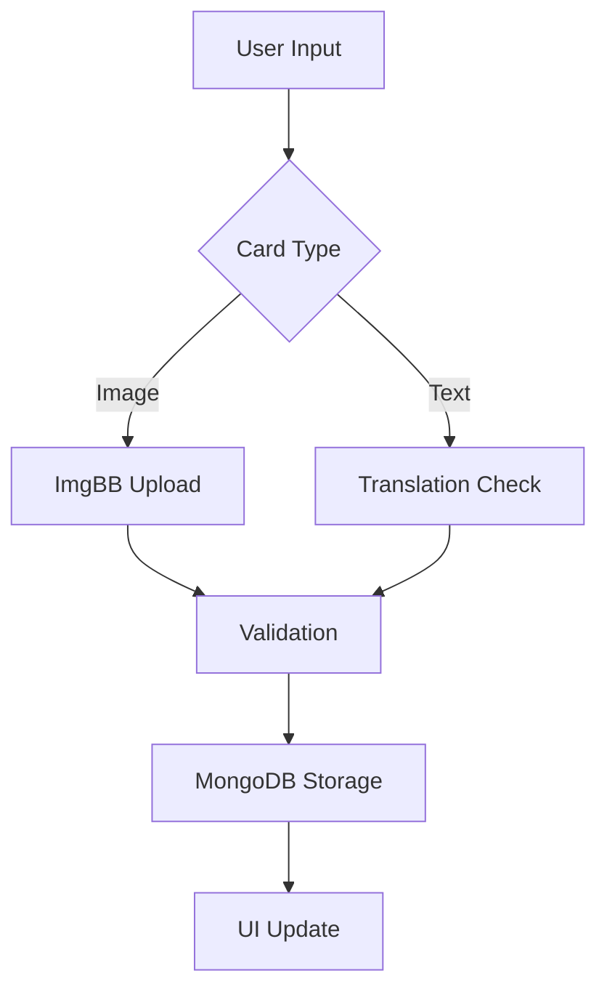
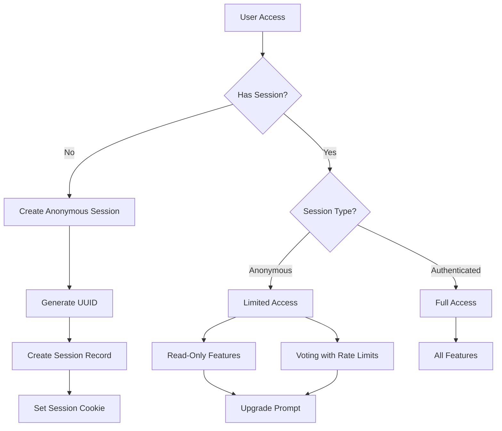
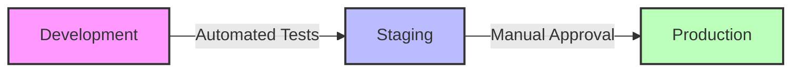

# System Architecture

Last Updated: 2024-01-16T16:30:00.000Z

## Version Status

Current Version: v5.0.0
Status: Active Development

## System Overview

NARIMATO is a Next.js application with TypeScript and Tailwind CSS, using MongoDB Atlas as its database and Redis for caching. The architecture follows a modular approach with clear separation of concerns, emphasizing performance, scalability, and security.

Key Infrastructure Components:
- Next.js + React.js: Frontend and API routes
- MongoDB Atlas: Primary database
- Redis: Caching and rate limiting
- Socket.io: Real-time updates
- Vercel: Deployment and hosting

## Component Hierarchy

### 1. Frontend Layer
```
/components
├── UI/                   # UI primitives
│   ├── Typography.tsx    # Centralized text styling
│   ├── Card.tsx         # Base card component
│   ├── CardContainer.tsx # Card layout management
│   ├── CardFilters.tsx  # Filtering interface
│   ├── CardForm.tsx     # Card creation/editing
│   ├── CardList.tsx     # Card listing component
│   ├── Navigation.tsx   # App navigation
│   ├── SwipeController.tsx # Swipe interactions
│   ├── VoteSystem.tsx   # Voting interface
│   └── LeaderboardCard.tsx # Ranking display
├── Project/             # Project management
│   ├── CardManager.tsx  # Project card organization
│   ├── DeleteProjectModal.tsx # Project deletion confirmation
│   ├── ProjectForm.tsx  # Project creation/editing
│   ├── ProjectSettings.tsx # Project configuration
│   ├── ProjectWithRealtime.tsx # Real-time project updates
│   └── ProjectsMenu.tsx # Project navigation
├── Layout/              # Layout components
│   ├── Container.tsx    # Responsive container
│   └── Grid.tsx        # Grid system
```

### 2. Page Structure
```
/pages
├── index.tsx            # Enhanced homepage design
├── _app.tsx             # Application wrapper with providers
├── card/
│   ├── [slug].tsx       # Individual card view/edit
│   ├── create.tsx       # Card creation interface
│   └── list.tsx         # Card listing with filters
├── project/[slug].tsx   # Project management
├── vote.tsx             # Card voting interface
├── vote.tsx             # Head-to-head voting
├── leaderboard.tsx      # Global rankings
└── dashboard.tsx        # Admin interface
```

### 3. Data & Utils Layer
```
/utils
├── db/
│   ├── connect.ts       # MongoDB connection handler
│   └── models/          # Mongoose models & schemas
├── validation/
│   ├── card.ts          # Zod schemas for card data
│   └── project.ts       # Project validation schemas
├── services/
│   ├── imgbb.ts         # Image upload service
│   ├── elo.ts           # Rating calculations
│   └── ranking.ts       # Sorting algorithms
└── helpers/            # Utility functions
```

### Data Flow & Integration

### Project Ranking System
The project ranking system uses a modified ELO rating algorithm adapted for project-specific contexts:

```typescript
interface RankingCalculation {
  baseK: number;           // Base K-factor (typically 32)
  projectFactor: number;   // Project-specific multiplier (0.5-2.0)
  voteDelta: number;       // Vote strength (1-10)
  timeDecay: number;       // Time-based decay factor (0.95-1.0)
}

// Ranking Formula:
function calculateNewRating(current: number, expected: number, actual: number, config: RankingCalculation): number {
  const adjustedK = config.baseK * config.projectFactor * config.timeDecay;
  return current + adjustedK * (actual - expected);
}

// Expected Score Calculation:
function calculateExpectedScore(ratingA: number, ratingB: number): number {
  return 1 / (1 + Math.pow(10, (ratingB - ratingA) / 400));
}
```

### Vote System Flow


### Card Management Flow


### Card Processing Flow


### Key Features

### Typography System v1.0.0
- Centralized Typography Configuration:
  - Consistent font scales from xs (12px) to 6xl (60px)
  - Responsive text behavior with mobile-first design
  - System fonts with fallbacks for optimal performance
  - Unified line height and letter spacing scales

- Text Components:
  - H1: Large headlines (4xl-6xl) with tight tracking
  - H2: Section headers (3xl-4xl) with medium weight
  - H3: Subsection headers (2xl-3xl) with balanced spacing
  - Body: Main content text with relaxed line height
  - SmallText: Secondary content with normal spacing
  - Caption: Small, muted text for supplementary info

- Design Principles:
  - Mobile-first responsive typography
  - Consistent vertical rhythm
  - Accessible font sizes and contrast
  - Maintainable type scale system

### Card System v1.0.0
- Enhanced Card Components:
  - Image Cards: Original aspect ratio preservation
  - Text Cards: Fixed 3:4 ratio with dynamic resizing
  - Container-based styling system
  - Hashtag support and filtering
  - Optional translation support for all card types

### Image Processing
- ImgBB Integration:
  - Secure upload handling
  - File validation (32MB limit)
  - Supported formats: JPG, PNG, GIF, TIF, WEBP, HEIC, AVIF, PDF

### User System
- TypeScript-based session management
- UUID-based identity system
- Role-based access control (RBAC)
- Enhanced admin dashboard

### Real-time Features
- Socket.io integration
- Live updates for card changes
- Real-time leaderboard updates
- Activity broadcasting

## Technical Specifications

### Recent Technical Improvements v1.1.0

#### 1. TypeScript Improvements
```typescript
// SwipeStore Type Corrections
interface SwipeState {
  direction: 'left' | 'right' | null;
  offset: number;
  isDragging: boolean;
  currentCard: string | null;
}

// Zustand Persist Middleware Type Declaration
interface PersistOptions<T> {
  name: string;
  storage?: StorageValue<T>;
  partialize?: (state: T) => Partial<T>;
  version?: number;
  migrate?: (state: T, version: number) => T;
}

type StorageValue<T> = {
  getItem: (name: string) => T | null | Promise<T | null>;
  setItem: (name: string, value: T) => void | Promise<void>;
  removeItem: (name: string) => void | Promise<void>;
};
```

#### 2. Backend Stability
```typescript
// Mongoose Model Registration System
class ModelRegistry {
  private static models = new Map<string, mongoose.Model<any>>();

  static register<T>(name: string, schema: mongoose.Schema<T>): mongoose.Model<T> {
    if (!this.models.has(name)) {
      const model = mongoose.model<T>(name, schema);
      this.models.set(name, model);
      return model;
    }
    return this.models.get(name) as mongoose.Model<T>;
  }

  static getModel<T>(name: string): mongoose.Model<T> | undefined {
    return this.models.get(name) as mongoose.Model<T>;
  }
}

// Database Interaction Layer
interface DatabaseOperation<T> {
  execute(): Promise<T>;
  rollback(): Promise<void>;
  validate(): Promise<boolean>;
}

class DatabaseTransaction {
  private operations: DatabaseOperation<any>[] = [];

  async execute<T>(operation: DatabaseOperation<T>): Promise<T> {
    try {
      if (await operation.validate()) {
        const result = await operation.execute();
        this.operations.push(operation);
        return result;
      }
      throw new Error('Validation failed');
    } catch (error) {
      await this.rollback();
      throw error;
    }
  }

  private async rollback(): Promise<void> {
    for (const op of this.operations.reverse()) {
      await op.rollback();
    }
  }
}
```

#### 3. Component Architecture
```typescript
// ProjectForm Component Structure
interface ProjectFormProps {
  initialData?: Partial<Project>;
  onSubmit: (data: Project) => Promise<void>;
  onCancel: () => void;
}

// Form State Management
interface FormState<T> {
  data: T;
  errors: Record<keyof T, string[]>;
  touched: Set<keyof T>;
  isSubmitting: boolean;
  isDirty: boolean;
}

type FormAction<T> =
  | { type: 'SET_FIELD'; field: keyof T; value: any }
  | { type: 'SET_ERRORS'; errors: Record<keyof T, string[]> }
  | { type: 'TOUCH_FIELD'; field: keyof T }
  | { type: 'SUBMIT_START' | 'SUBMIT_END' | 'RESET' };
```

### Security Architecture

### Authentication Flow


- **Session Management**:
  - UUID-based session identification with `session-id`
  - Anonymous sessions automatically created for new visitors
  - Enhanced session persistence with secure cookie handling
  - Seamless upgrade path from anonymous to authenticated
  - Multi-level rate limiting (IP + session-based)
  - Session data cleanup with configurable expiration

- **Access Levels**:
  - Anonymous:
    - Read-only access to public content
    - Basic voting capabilities with rate limits
    - Temporary data storage
    - No content creation/editing
  - Authenticated:
    - Full platform access
    - Project creation and management
    - Unrestricted voting
    - Persistent data storage
  - Admin:
    - System configuration
    - User management
    - Analytics access
    - Rate limit overrides

### Data Validation & Safety
- Comprehensive Zod schema validation
- Type-safe input handling
- Strict input sanitation
- File type verification

## Database Architecture

### Card Collection
```typescript
interface Card {
  type: 'image' | 'text';
  content: string;          // URL for images, text content for text cards
  hashtags: string[];       // Indexed for efficient filtering
  translations?: {
    [locale: string]: {
      content: string;
      lastUpdated: Date;
    }
  };
  metadata: {
    dimensions?: {
      width: number;
      height: number;
    };
    fileSize?: number;      // For images only
    format?: string;        // File format for images
  };
  slug: string;             // URL-friendly unique identifier
  status: 'active' | 'archived' | 'deleted';
  createdAt: Date;
  updatedAt: Date;
}
```

### Project Collection
```typescript
interface Project {
  name: string;
  description: string;
  cards: ObjectId[];        // References to Card collection
  settings: {
    visibility: 'public' | 'private';
    allowComments: boolean;
    cardOrder: 'manual' | 'date' | 'popularity';
  };
  createdAt: Date;
  updatedAt: Date;
}
```

### User Collection
```typescript
interface User {
  uuid: string;              // Unique identifier
  role: 'admin' | 'user' | 'guest' | 'anonymous';
  sessionType: 'anonymous' | 'authenticated';
  preferences: {
    darkMode: boolean;
    language: string;
    notifications: {
      email: boolean;
      push: boolean;
    };
  };
  lastActive: Date;
  createdAt: Date;
  updatedAt: Date;
  anonymousData?: {
    sessionId: string;
    createdAt: Date;
    lastActive: Date;
    votingHistory: string[];  // Array of card IDs voted on
  };
}
```

### Session Collection
```typescript
interface Session {
  sessionId: string;         // Unique session identifier
  userId: string;            // Reference to User collection
  type: 'anonymous' | 'authenticated';
  status: 'active' | 'expired' | 'upgraded';
  deviceInfo: {
    userAgent: string;
    ip: string;
    lastKnownLocation?: string;
  };
  createdAt: Date;
  expiresAt: Date;
  lastActive: Date;
}
```

## Deployment & DevOps

### Environment Structure


### CI/CD Pipeline v1.0.0
- Vercel-based deployment automation
- Environment-specific configurations
- TypeScript type checking
- Automated testing pipeline
- Database migration management
- Performance monitoring

### Performance Optimization
- Static page generation where possible
- Image optimization pipeline
- MongoDB query optimization
- Client-side caching strategy
