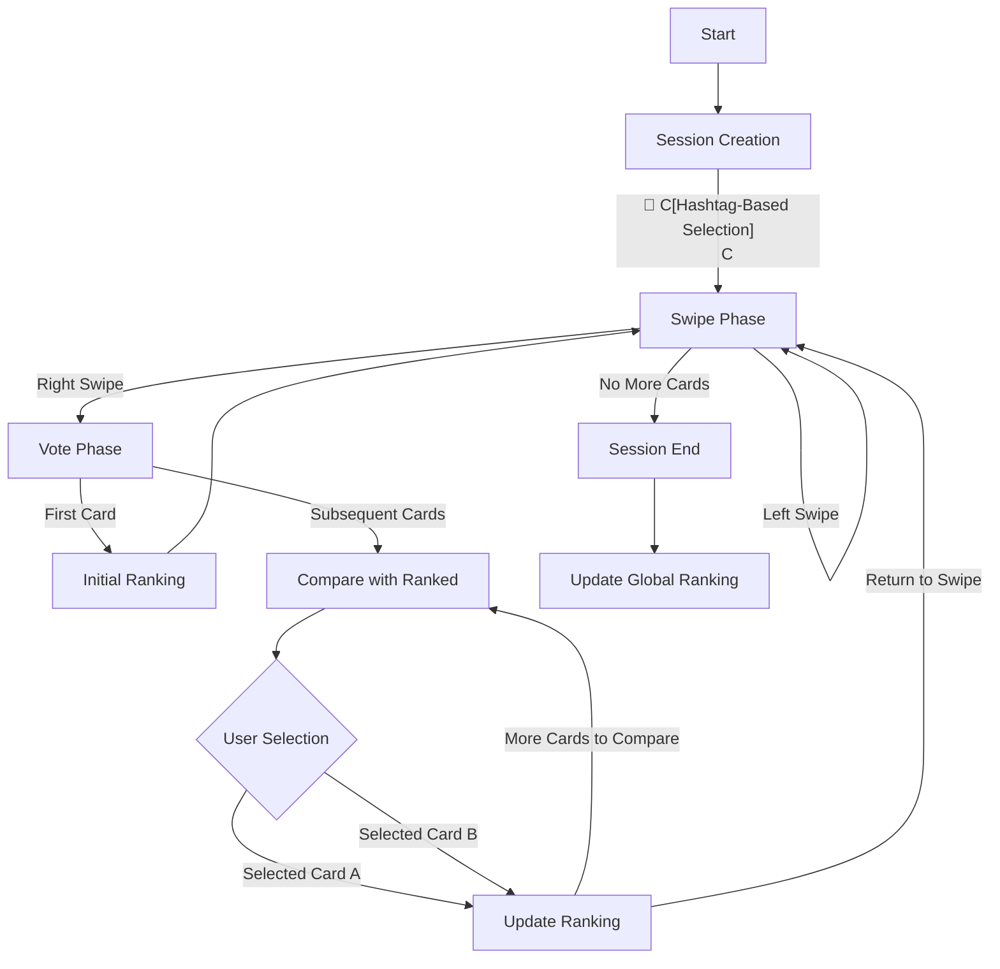
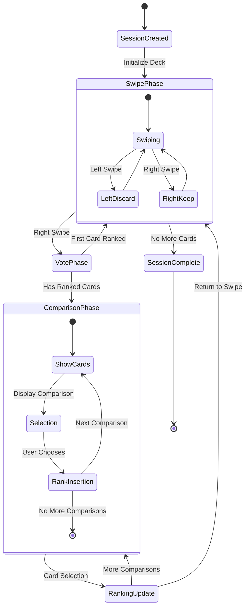
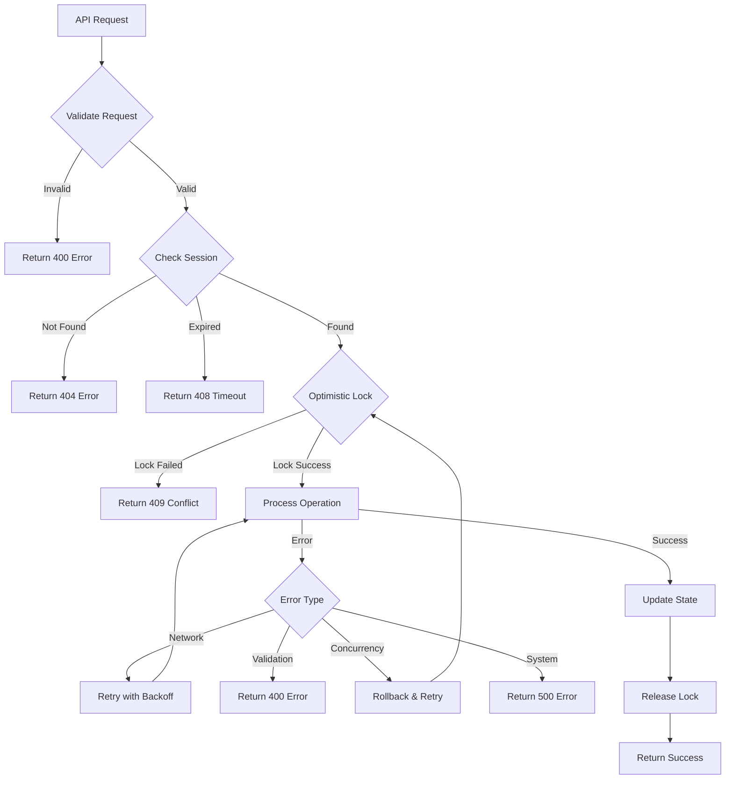
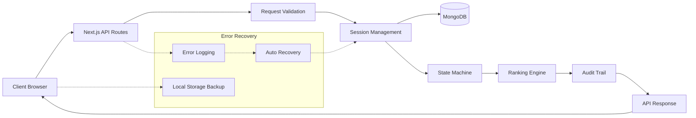
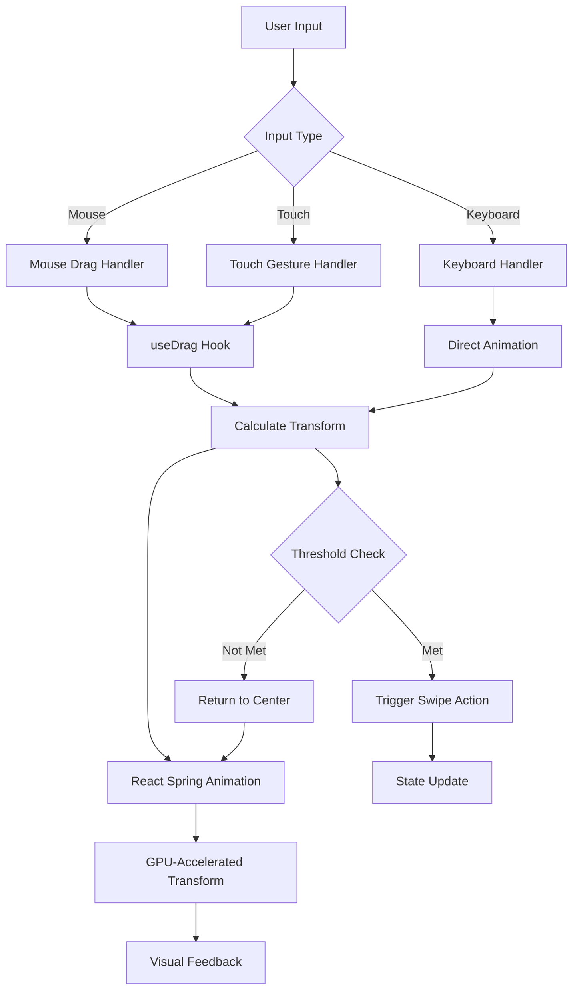

# NARIMATO Architecture

**Current Version:** 6.9.0 (Onboarding UX + Right-Swipe Semantics)
**Date:** 2025-09-16T07:11:23.000Z
**Last Updated:** 2025-09-16T07:11:23.000Z

## ⚡ UUID Field Standardization (v3.7.1+)

**CRITICAL ARCHITECTURAL CHANGE**: All UUID fields throughout the codebase now use standardized naming:

- **OrganizationUUID**: For all organization identifiers
- **SessionUUID**: For all session identifiers
- **PlayUUID**: For all play session identifiers  
- **CardUUID**: For all card identifiers
- **DeckUUID**: For all deck identifiers

### Field Constants Location
All field constants are centralized in `/app/lib/constants/fieldNames.ts`:

```typescript
export const UUID_FIELDS = {
  ORGANIZATION: 'OrganizationUUID',
  SESSION: 'SessionUUID',
  PLAY: 'PlayUUID', 
  CARD: 'CardUUID',
  DECK: 'DeckUUID'
} as const;
```

### Models Updated
- **Play Model**: Uses standardized PlayUUID, SessionUUID, DeckUUID
- **Session Model**: Uses standardized SessionUUID
- **Card Model**: Uses standardized CardUUID

### Validation Functions
Standardized validation functions available:
- `validateOrganizationUUID(OrganizationUUID: string): boolean`
- `validateSessionUUID(SessionUUID: string): boolean`
- `validatePlayUUID(PlayUUID: string): boolean`
- `validateCardUUID(CardUUID: string): boolean`
- `validateDeckUUID(DeckUUID: string): boolean`

### Backward Compatibility
Temporary backward compatibility exports exist for legacy field names but will be removed in a future version.

### Migration Impact
- All models use standardized field naming
- Database queries updated to use new field constants
- API responses maintain consistency with standardized field names
- Frontend components updated to handle uniform UUID fields

## System Overview

NARIMATO is a comprehensive card ranking application featuring advanced content management capabilities. Built with Next.js, MongoDB, and sophisticated UI components, it provides a complete ecosystem for card creation, editing, and ranking with features including smart hashtag management, deck organization, and real-time collaborative ranking.

## Flow Diagrams

### 1. Session Lifecycle


### 2. State Transitions


### 3. Error Handling Flow


### 4. Data Flow Architecture


## 🎨 Organization-Level Centralized Theme Management (v4.1.0+)

### Overview
NARIMATO now features a comprehensive organization-level centralized theme management system that allows organizations to maintain consistent visual identity across all components. This system provides administrators with powerful tools to customize animated backgrounds, typography, and visual elements.

### Key Features

#### Animated Background Management
- **Background CSS Editor**: Full code editor with syntax highlighting for CSS animations
- **Dynamic CSS Injection**: CSS is dynamically injected into a dedicated `.background-content` layer
- **Wave Animations**: Support for complex animated backgrounds including wave effects
- **Organization Scoping**: Each organization can have unique animated backgrounds
- **Live Preview**: Real-time preview of background changes in the organization editor

#### Google Fonts Integration
- **URL Input**: Direct input of Google Fonts CSS2 URLs for typography customization
- **Dynamic Loading**: Fonts are dynamically loaded into the document head
- **Organization-Wide Application**: Font choices apply across all organization components
- **Fallback Support**: Graceful fallback to system fonts if custom fonts fail to load
- **Live Typography Preview**: Immediate preview of font changes in the editor

#### Emoji and Icon Management
- **Emoji Input**: Direct emoji pasting with space-separated input format
- **Icon URL Support**: CDN-based icon management with URL input
- **Visual Preview**: Live preview of emojis and icons in the editor interface
- **Centralized Storage**: Organization-level storage of emoji and icon sets
- **Easy Management**: Add, remove, and reorder emojis and icons through the UI

### Technical Architecture

#### Schema Extensions
The `Organization` model in `app/lib/models/Organization.ts` includes new theme fields:
```typescript
interface Organization {
  // ... existing fields
  theme?: {
    // ... existing theme properties
    backgroundCSS?: string;     // Custom CSS for animated backgrounds
    googleFontURL?: string;     // Google Fonts CSS2 URL
    emojiList?: string[];       // Array of emoji characters
    iconList?: string[];        // Array of icon URLs
  };
}
```

#### Theme Hook Enhancement
The `useOrganizationTheme` hook now provides comprehensive theme management:
- **Background Injection**: Dynamically injects background CSS into `.background-content` div
- **Font Loading**: Manages Google Fonts link tags in document head
- **Cleanup Management**: Properly removes and updates styles when themes change
- **Organization Scoping**: Ensures theme isolation between organizations

#### Layout Integration
Layout Integration (Pages Router):
- The application uses the Pages Router and central styles are loaded via `pages/_document.js`.
- A dedicated background layer is not currently injected by layout; background/theming strategies can be implemented via components and global CSS.

#### CSS Foundation
Base styles for the background layer:
```css
.background-content {
  position: fixed;
  top: 0;
  left: 0;
  width: 100vw;
  height: 100vh;
  z-index: -1;
  pointer-events: none;
}
```

### Organization Editor Enhancements

#### Live Theme Preview System
- **Real-Time Updates**: All theme changes are reflected instantly in the editor
- **Comprehensive Preview**: Background, fonts, emojis, and icons previewed simultaneously
- **Editor Integration**: Preview component uses the same `useOrganizationTheme` hook as the main application
- **Visual Feedback**: Clear indicators show active theme settings

#### Code Editor Integration
- **Syntax Highlighting**: PrismJS integration for CSS syntax highlighting
- **Error Prevention**: Input validation to prevent malicious or breaking CSS
- **Scoped Application**: CSS is automatically scoped to the background layer
- **Live Compilation**: Changes are applied immediately without page refresh

#### User Experience Features
- **Emoji Display**: Live preview of emoji selections with proper rendering
- **Icon Preview**: Image previews of icon URLs with error handling
- **Font Validation**: URL validation for Google Fonts with helpful error messages
- **Save Confirmation**: Clear success/error feedback for theme updates

### Security and Performance Considerations

#### CSS Security
- **Input Sanitization**: CSS input is validated to prevent XSS attacks
- **Scope Limitation**: CSS is restricted to the `.background-content` layer
- **Safe Injection**: Dynamic CSS injection uses secure DOM methods

#### Performance Optimization
- **Efficient Loading**: Google Fonts are loaded only when needed
- **Memory Management**: Proper cleanup of style elements when themes change
- **Minimal DOM Impact**: Theme changes use targeted updates rather than full re-renders
- **Caching Strategy**: Theme settings are cached for optimal performance

### Migration and Compatibility

#### Backward Compatibility
- **Existing Organizations**: Organizations without theme settings continue to work normally
- **Graceful Fallbacks**: Missing theme properties default to system styles
- **Progressive Enhancement**: Theme features enhance existing functionality without breaking changes

#### Future Extensibility
- **Plugin Architecture**: Foundation for additional theme plugins and extensions
- **Advanced Animations**: Support for more complex animation systems
- **Theme Templates**: Potential for pre-built theme templates and marketplace
- **User-Level Themes**: Architecture supports future user-level theme customization

## Theming

NARIMATO supports both light and dark themes to enhance user experience and accessibility. The theming system is built using CSS custom properties and a `data-theme` attribute, allowing for easy extension and modification.

### Implementation
- **Strategy**: Class-based dark mode is enabled in `tailwind.config.js` (`darkMode: 'class'`).
- **Activation**: The dark theme is activated by adding `data-theme="dark"` to the `<html>` element in `app/layout.tsx`.
- **CSS Variables**: A comprehensive set of CSS variables for colors, shadows, and other themeable properties is defined in `app/globals.css`. The `:root` selector defines the light theme, and the `[data-theme="dark"]` attribute selector overrides these variables for the dark theme.
- **Usage**: Components use Tailwind CSS utility classes that are configured to respect the dark mode variant (e.g., `bg-white dark:bg-gray-900`).

## System Components

### Core API Endpoints

New components (v6.4.0):
- `lib/services/RankMoreEngine.js` — orchestrates hierarchical multi-level ranking using Rank-Only segments per family
- `lib/models/RankMorePlay.js` — persistence model for Rank-More orchestration
- **Play (Unified)**:
  - `POST /api/v1/play/start`
  - `POST /api/v1/play/{playId}/input`
  - `GET /api/v1/play/{playId}/next`
  - `GET /api/v1/play/{playId}/results`
- **Card Management**: `/api/cards`, `/api/cards/[uuid]`, `/api/cards/rankings`
- **System Utilities**: as existing (rate limiting, middleware)

Note: Legacy endpoints under `/api/swipe-only/*`, `/api/swipe-more/*`, and `/api/vote-only/*` have been removed. All modes are routed via the unified Play dispatcher.

## Analytics Integration (v5.6.0)

- FUNCTIONAL: GA4 integrated for SPA pageviews and gameplay events
- STRATEGIC: Privacy-first, production-only analytics with Consent Mode v2

Components:
- `/lib/analytics/ga.js` — helper functions: `pageview`, `event`, consent helpers; guards for `isProd` and `GA_ID`
- `pages/_app.js` — loads GA script with `next/script`, initializes Consent Mode (default denied), and tracks pageviews on router changes

Events:
- `play_start`, `swipe_action`, `vote_cast`, `segment_end`, `play_complete`, `results_view`

Consent:
- Defaults to denied; toggle via `window.NARIMATO_setAnalyticsConsent(true|false)`
- IP anonymization enabled on all hits

CSP considerations (if/when enforced):
- script-src: https://www.googletagmanager.com https://www.google-analytics.com
- connect-src/img-src: https://www.google-analytics.com (and region endpoints)

### Play Modes (v6.4.0)

Last Updated: 2025-09-07T11:34:45.000Z

- Swipe-Only (building block)
  - Flow: present all cards one-by-one for left/right decisions; right = like (ranked by first-like order), left = reject.
  - Start returns: playId, cards[], currentCardId.
  - Input: action='swipe', payload={ cardId, direction }.
  - Next: current card context or completed.
  - Results: ranking of liked cards in swipe order, plus stats.

- Vote-Only (building block)
  - Flow: UNRANKED → choose 2 → user seeds ranking; then for each CHALLENGER from UNRANKED append to end of PERSONAL and compare against a random opponent from RANKED; prune RANKED based on winner/loser rule; continue until TEMP pool empties; repeat until UNRANKED empty.
  - Ensures correct pruning rules (delete opponent and worse/better from temporary RANKED) and moves CHALLENGER accordingly.
  - Start returns: playId, cards[], initial comparison; Input uses action='vote'.
  - Next: next challenger/opponent or completed.
  - Results: ranking (rich objects) and personalRanking (IDs), plus stats.

- Swipe-More (composed from Swipe-Only)
  - Orchestrates multiple Swipe-Only "family" segments: root family → children of liked parents → grandchildren, etc.
  - Engine maintains familiesToProcess queue, currentFamilyIndex, and activeSwipeOnlySession.
  - Each completed family appends its liked results (with context) into combinedRanking; enqueues child families for liked parents with children.
  - Optional tie-break comparisons supported via action='vote' during the flow.
  - Results: combinedRanking with family context and a family breakdown.

See docs/API_REFERENCE.md for detailed request/response examples for all modes using the unified endpoints.

- Rank-Only (composed from Swipe-Only + Vote-Only)
  - Flow: Swipe to shortlist, then vote-only to order liked cards; server signals requiresVoting to switch phases.
  - Start returns: initial swipe deck; input uses action='swipe' until switch to action='vote'.
  - Results: personalRanking of liked cards in voted order; statistics.

- Rank-More (orchestrated Rank-Only per family)
  - Flow: Rank-Only at roots, then for each liked parent with children run Rank-Only on its children; families processed in random order within each level.
  - Branch Exclusion: Disliked children exclude their entire branch.
  - Transitions: Engine may return `{ returnToSwipe, nextCardId, cards }` to switch back to swiping a new family.
  - Results: flattened list only — parent followed by ranked descendants (depth-first).

### Database Models
- **Session**: Core session state with optimistic locking
- **Card**: Individual card data with content validation, hashtags, and slug support
- **Play**: Dynamic session management with hashtag-based card selection
- **PersonalRanking**: User-specific card rankings
- **GlobalRanking**: ELO-based aggregate rankings across all sessions (primary metric: ELO rating, not total score)
- **SystemVersion**: Application version tracking
- **FontPreset**: Customizable font configurations for card styling
- **BackgroundPreset**: Background and styling presets for visual customization

### Deck Playability Rules
- **Minimum Card Threshold**: DECK_RULES.MIN_CARDS_FOR_PLAYABLE = 2 (defined in constants/fieldNames.ts)
- **Purpose**: Ensures meaningful ranking experiences by requiring at least 2 cards for comparison
- **Implementation**: Enforced in cardHierarchy.ts filtering logic, cards API responses, and play start API validation
- **User Experience Impact**: Prevents single-card deck sessions that provide no ranking/comparison opportunities

### Frontend Components
- **SwipeCard**: Interactive swipe interface with advanced gesture support and real-time animations
- **VoteCard**: Comparison voting interface
- **CardEditor**: Comprehensive card creation and editing interface with live preview
- **HashtagEditor**: Smart hashtag management with predictive suggestions and keyboard navigation
- **CardManagement**: Deck-card association interface for organizing content
- **DeckEditor**: Complete deck creation and management system
- **ErrorBoundary**: Comprehensive error handling and recovery

## Swipe Animation Architecture

### Overview
NARIMATO's swipe animation system provides sophisticated real-time visual feedback through a combination of advanced gesture detection and physics-based animations. The architecture prioritizes performance, cross-platform compatibility, and user experience.

### Core Technologies

#### @use-gesture/react (v10.3.1)
- **Purpose**: Advanced gesture recognition and handling
- **Capabilities**: Mouse, touch, and pointer event unification
- **Features**: Velocity calculation, direction detection, threshold management
- **Performance**: Optimized event handling with minimal overhead

#### @react-spring/web (v9.7.3)
- **Purpose**: Physics-based animation system
- **Features**: Spring animations, GPU acceleration, smooth interpolation
- **Configuration**: Customizable tension, friction, and animation curves
- **Performance**: Hardware-accelerated transforms for 60fps animations

### Animation Flow



### Gesture Detection System

#### Unified Input Handling
```typescript
const bind = useDrag(({ active, movement: [mx], direction: [xDir], velocity: [vx] }) => {
  // Unified handling for mouse and touch inputs
  const trigger = Math.abs(mx) > innerWidth * 0.2; // 20% threshold
  const isGone = !active && trigger;
  
  // Calculate transform values
  const x = isGone ? (200 + window.innerWidth) * xDir : active ? mx : 0;
  const rot = mx / 100 + (isGone ? xDir * 10 * vx : 0);
  const scale = active ? 1.1 : 1;
  
  // Apply animations
  api.start({ x, rot, scale, config: { /* optimized settings */ } });
});
```

#### Threshold Configuration
- **Swipe Trigger**: 20% of screen width for consistent experience across devices
- **Velocity Sensitivity**: Rotation and scaling based on drag velocity
- **Adaptive Behavior**: Responsive to different screen sizes and orientations

### Animation Configuration

#### Spring Physics
```typescript
const [{ x, y, scale, rot }, api] = useSpring(() => ({
  x: 0,        // Horizontal position
  y: 0,        // Vertical position (reserved)
  scale: 1,    // Card scaling factor
  rot: 0,      // Rotation angle
  config: { 
    tension: 300,  // Spring responsiveness
    friction: 20   // Movement damping
  }
}));
```

#### Performance Optimizations
- **GPU Acceleration**: Using transform properties (translateX, rotateZ, scale)
- **Efficient Updates**: Minimal DOM manipulation through React Spring
- **Memory Management**: Proper cleanup of animation resources
- **Event Throttling**: Optimized event handling to prevent excessive updates

### Cross-Platform Compatibility

#### Desktop Experience
- **Mouse Events**: Full mouse drag support with cursor state feedback
- **Keyboard Support**: Arrow key navigation with smooth animations
- **Visual Feedback**: Cursor changes (grab/grabbing) for intuitive interaction

#### Mobile Experience
- **Touch Events**: Native touch gesture support
- **Prevent Scrolling**: Touch action none to prevent page scrolling conflicts
- **Responsive Thresholds**: Adaptive swipe detection based on device characteristics

#### Tablet Support
- **Orientation Handling**: Consistent behavior in portrait and landscape modes
- **Touch Target Optimization**: Appropriate touch areas for different screen sizes
- **Performance Scaling**: Animations maintain quality across different hardware

### State Management Integration

#### Animation State Synchronization
```typescript
const handleSwipeAction = useCallback((direction: 'left' | 'right') => {
  // Prevent concurrent operations
  if (swipeState !== 'idle' || swipeLock) {
    console.warn('Concurrent swipe detected');
    return;
  }
  
  // Update application state
  setSwipeDirection(direction);
  setSwipeState('swiping');
  setSwipeLock(true);
  
  // Process swipe with error recovery
  onSwipe(direction)
    .then(() => setSwipeState('voted'))
    .catch(() => {
      // Reset animation and state
      api.start({ x: 0, rot: 0, scale: 1 });
      setSwipeState('error');
    });
}, [swipeState, swipeLock, onSwipe, api]);
```

#### Concurrent Operation Prevention
- **State Locking**: Prevents multiple simultaneous swipe operations
- **Animation Coordination**: Ensures animations don't conflict with state changes
- **Error Recovery**: Automatic reset of both animation and application state

### Performance Metrics

#### Animation Performance
- **Frame Rate**: Consistent 60fps across all supported devices
- **Input Latency**: Sub-16ms response time for touch/mouse inputs
- **Memory Usage**: Minimal overhead through efficient resource management
- **CPU Usage**: GPU-accelerated animations reduce main thread blocking

#### Optimization Strategies
- **Transform-Only Animations**: Avoiding layout-triggering properties
- **Event Pooling**: Efficient event handler management
- **Component Memoization**: React.memo and useCallback for render optimization
- **Resource Cleanup**: Proper disposal of event listeners and animation resources

### Error Handling

#### Gesture Conflicts
- **Prevention**: Removed conflicting gesture libraries (react-swipeable)
- **Detection**: Runtime detection of concurrent gesture attempts
- **Recovery**: Automatic state reset and user notification

#### Animation Failures
- **Fallback Behavior**: Graceful degradation when animations fail
- **Error Logging**: Comprehensive logging for debugging and monitoring
- **User Feedback**: Clear visual indicators for error states

### Accessibility

#### Keyboard Navigation
- **Arrow Key Support**: Full keyboard navigation with smooth animations
- **Visual Feedback**: Consistent animation behavior for keyboard interactions
- **Screen Reader**: Proper state announcements during swipe operations

#### Motion Preferences
- **Reduced Motion**: Respect for user's motion preference settings
- **Customizable Animation**: Future support for animation speed controls
- **High Contrast**: Animations work well with high contrast modes

### Future Enhancements

#### Planned Improvements
- **Haptic Feedback**: Integration with device haptic systems
- **Multi-Touch Gestures**: Advanced gesture recognition for power users
- **Customizable Animations**: User-configurable animation preferences
- **Analytics Integration**: Gesture pattern analysis for UX improvements

#### Technical Roadmap
- **WebGL Animations**: Explore WebGL for even more sophisticated effects
- **PWA Integration**: Enhanced animations for Progressive Web App experience
- **Performance Monitoring**: Real-time animation performance analytics
- **Accessibility Enhancements**: Advanced accessibility features for gesture interactions
nsive error handling and recovery

## Error Handling Procedures

### 1. Request Validation Errors (400)
**Trigger**: Invalid request format, missing fields, type mismatches

**Handling**:
- Immediate rejection with detailed error messages
- Client-side form validation to prevent submission
- Zod schema validation for type safety

**Recovery**:
- User corrects input based on error messages
- No server-side state changes occur

### 2. Session Errors (404/408)
**Trigger**: Session not found, expired, or invalid state

**Handling**:
- Session validation before any operations
- Automatic session cleanup via TTL indexes
- Client-side session state backup

**Recovery**:
- Attempt session recovery from localStorage
- Create new session if recovery fails
- Preserve user progress where possible

### 3. Concurrency Conflicts (409)
**Trigger**: Optimistic locking failures, concurrent modifications

**Handling**:
- Version-based optimistic locking on all updates
- Automatic rollback on conflicts
- Exponential backoff retry strategy

**Recovery**:
- Automatic retry with fresh session data
- User notified only if repeated failures occur
- State synchronization before retry attempts

### 4. Network/System Errors (500/503)
**Trigger**: Database unavailable, server overload, system failures

**Handling**:
- Comprehensive error logging with context
- Circuit breaker pattern for external services
- Graceful degradation where possible

**Recovery**:
- Automatic retry with exponential backoff
- Fallback to cached data when available
- User notification for persistent failures

### 5. Client-Side Error Recovery
**Local Storage Backup**:
- Automatic session state backup on each operation
- Recovery state validation before restoration
- Cleanup of expired backup data

**Error Logging**:
- Structured error logging with timestamps
- Error categorization for targeted recovery
- Performance impact monitoring

**Auto Recovery**:
- Session state synchronization on page load
- Automatic retry for transient failures
- User-initiated recovery options

## Binary Search Ranking System

### Algorithm Overview
NARIMATO implements a sophisticated binary search algorithm for optimal card positioning with O(log n) complexity.

### Key Components
- **Accumulated Search Bounds**: Each vote refines the search space for a card's final position
- **Automatic Position Detection**: System detects when search bounds collapse (start >= end)
- **Smart Comparison Selection**: Always compares against the middle card in current search space
- **State Synchronization**: Perfect alignment between frontend and backend session states

### Search Bounds Calculation
```typescript
function calculateSearchBounds(targetCard: string, ranking: string[], votes: Vote[]): Bounds {
  let start = 0, end = ranking.length;
  
  for (const vote of votes) {
    if (vote.winner === targetCard) {
      // Card ranks higher - narrow upper bound
      end = Math.min(end, ranking.indexOf(vote.loser));
    } else {
      // Card ranks lower - narrow lower bound  
      start = Math.max(start, ranking.indexOf(vote.winner) + 1);
    }
  }
  
  return { start, end };
}
```

### Performance Benefits
- ~40% reduction in average comparisons per card
- Automatic position determination eliminates unnecessary user interactions
- Efficient database updates through atomic operations
- Enhanced user experience with faster ranking completion

## State Management

## Session States
- **swiping**: User browsing and swiping cards
- **voting**: User comparing cards for ranking
- **comparing**: System performing binary search ranking
- **completed**: All cards processed, session finished

### State Transition Rules
1. **swiping → voting**: Right swipe on card
2. **voting → comparing**: Card needs comparison with existing ranking
3. **comparing → comparing**: More comparisons needed for positioning
4. **comparing → swiping**: Card positioned, return to deck
5. **swiping → completed**: No more cards in deck

### Validation Requirements
- State changes must follow defined transition matrix
- All state changes require session lock acquisition
- Rollback capability for failed transitions
- Audit trail for all state modifications

## Performance Considerations

### Database Optimization
- Indexed fields: sessionId, status, state, version, timestamps
- TTL indexes for automatic session cleanup
- Optimistic locking to minimize lock contention
- Connection pooling for database efficiency

### Client-Side Performance
- Debounced user interactions (300ms)
- Optimistic UI updates with rollback
- Efficient re-rendering with React state management
- Progressive loading for large card sets

### Caching Strategy
- No-cache headers for real-time data
- Client-side caching for static content
- Session state caching in localStorage
- Error log rotation to prevent storage overflow
