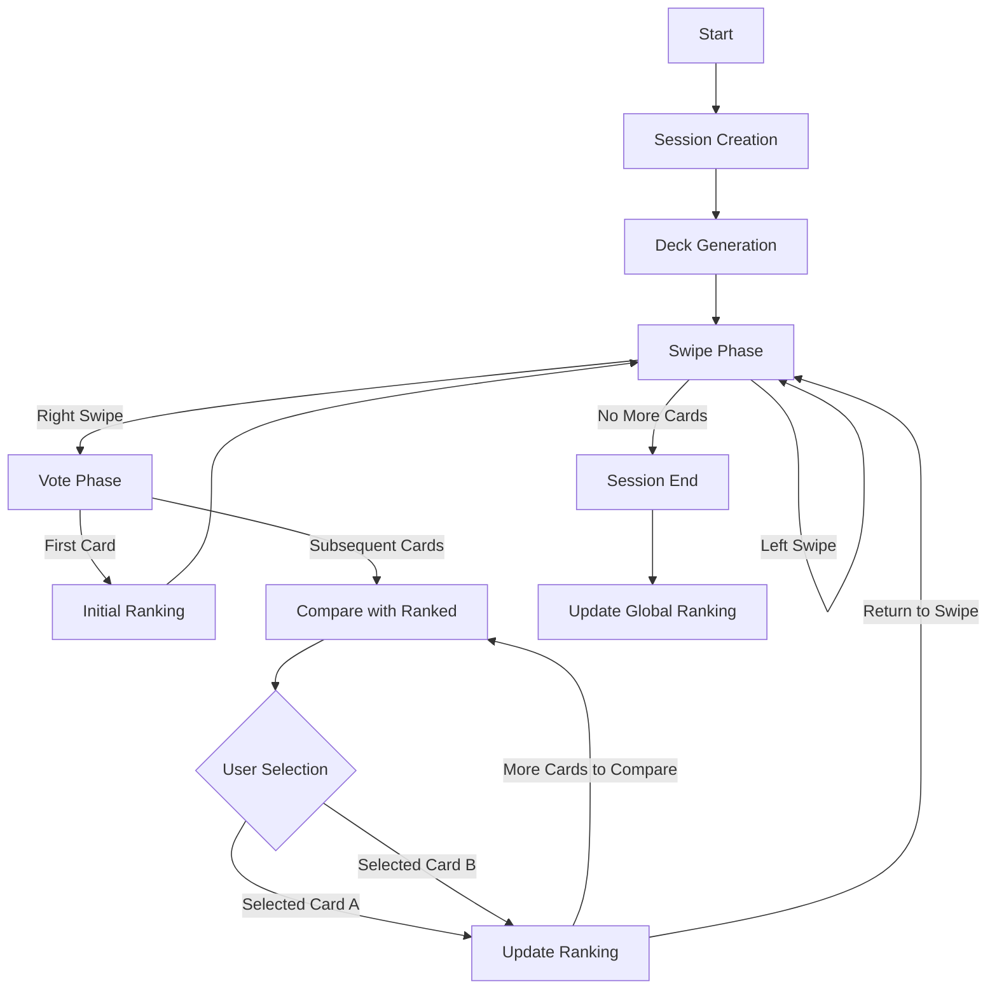
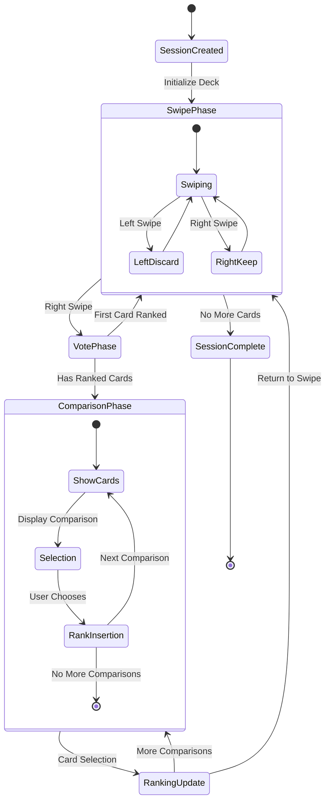
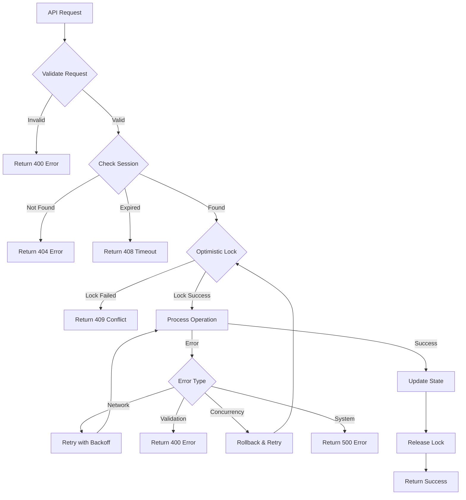
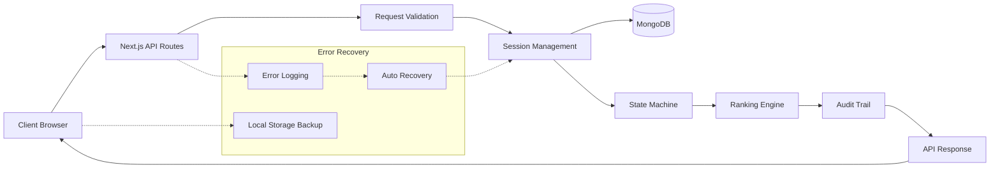

# NARIMATO Architecture

**Current Version:** 2.0.3 (Updated)
**Date:** 2025-07-30

## System Overview

NARIMATO is an advanced card ranking system offering real-time capabilities and a clean, user-friendly interface. It's built with Next.js, Vercel, MongoDB, Tailwind CSS, Mongoose, and Socket.io for interactive, scalable web applications.

## Flow Diagrams

### 1. Session Lifecycle

```mermaid
graph TD
    A[Start] --> B[Session Creation]
    B --> C[Deck Generation]
    C --> D[Swipe Phase]
    D --> |Left Swipe| D
    D --> |Right Swipe| E[Vote Phase]
    E --> |First Card| F[Initial Ranking]
    F --> D
    E --> |Subsequent Cards| G[Compare with Ranked]
    G --> H{User Selection}
    H --> |Selected Card A| I[Update Ranking]
    H --> |Selected Card B| I
    I --> |More Cards to Compare| G
    I --> |Return to Swipe| D
    D --> |No More Cards| J[Session End]
    J --> K[Update Global Ranking]
```

### 2. State Transitions

```mermaid
stateDiagram-v2
    [*] --> SessionCreated
    SessionCreated --> SwipePhase: Initialize Deck
    SwipePhase --> VotePhase: Right Swipe
    VotePhase --> SwipePhase: First Card Ranked
    VotePhase --> ComparisonPhase: Has Ranked Cards
    ComparisonPhase --> RankingUpdate: Card Selection
    RankingUpdate --> ComparisonPhase: More Comparisons
    RankingUpdate --> SwipePhase: Return to Swipe
    SwipePhase --> SessionComplete: No More Cards
    SessionComplete --> [*]
    
    state SwipePhase {
        [*] --> Swiping
        Swiping --> LeftDiscard: Left Swipe
        Swiping --> RightKeep: Right Swipe
        LeftDiscard --> Swiping
        RightKeep --> Swiping
    }
    
    state ComparisonPhase {
        [*] --> ShowCards
        ShowCards --> Selection: Display Comparison
        Selection --> RankInsertion: User Chooses
        RankInsertion --> ShowCards: Next Comparison
        RankInsertion --> [*]: No More Comparisons
    }
```

### 3. Error Handling Flow

```mermaid
flowchart TD
    A[API Request] --> B{Validate Request}
    B -->|Invalid| C[Return 400 Error]
    B -->|Valid| D{Check Session}
    D -->|Not Found| E[Return 404 Error]
    D -->|Expired| F[Return 408 Timeout]
    D -->|Found| G{Optimistic Lock}
    G -->|Lock Failed| H[Return 409 Conflict]
    G -->|Lock Success| I[Process Operation]
    I -->|Success| J[Update State]
    I -->|Error| K{Error Type}
    K -->|Network| L[Retry with Backoff]
    K -->|Validation| M[Return 400 Error]
    K -->|Concurrency| N[Rollback & Retry]
    K -->|System| O[Return 500 Error]
    J --> P[Release Lock]
    L --> I
    N --> G
    P --> Q[Return Success]
```

### 4. Data Flow Architecture

```mermaid
flowchart LR
    Client[Client Browser] --> API[Next.js API Routes]
    API --> Validation[Request Validation]
    Validation --> Session[Session Management]
    Session --> DB[(MongoDB)]
    Session --> State[State Machine]
    State --> Ranking[Ranking Engine]
    Ranking --> Audit[Audit Trail]
    Audit --> Response[API Response]
    Response --> Client
    
    subgraph "Error Recovery"
        LocalStorage[Local Storage Backup]
        ErrorLog[Error Logging]
        Recovery[Auto Recovery]
    end
    
    Client -.-> LocalStorage
    API -.-> ErrorLog
    ErrorLog -.-> Recovery
    Recovery -.-> Session
```

## Theming

NARIMATO supports both light and dark themes to enhance user experience and accessibility. The theming system is built using CSS custom properties and a `data-theme` attribute, allowing for easy extension and modification.

### Implementation
- **Strategy**: Class-based dark mode is enabled in `tailwind.config.js` (`darkMode: 'class'`).
- **Activation**: The dark theme is activated by adding `data-theme="dark"` to the `<html>` element in `app/layout.tsx`.
- **CSS Variables**: A comprehensive set of CSS variables for colors, shadows, and other themeable properties is defined in `app/globals.css`. The `:root` selector defines the light theme, and the `[data-theme="dark"]` attribute selector overrides these variables for the dark theme.
- **Usage**: Components use Tailwind CSS utility classes that are configured to respect the dark mode variant (e.g., `bg-white dark:bg-gray-900`).

## System Components

### Core API Endpoints
- **Session Management**: `/api/v1/session/start`, `/api/v1/session/validate`
- **Card Operations**: `/api/v1/swipe`, `/api/v1/vote`, `/api/v1/vote/comparison`
- **Data Retrieval**: `/api/v1/deck`, `/api/v1/ranking`, `/api/v1/rankings`
- **System Utilities**: `/api/v1/reset`, `/api/system/version`

### Database Models
- **Session**: Core session state with optimistic locking
- **Card**: Individual card data with content validation
- **PersonalRanking**: User-specific card rankings
- **GlobalRanking**: Aggregate rankings across all sessions
- **SystemVersion**: Application version tracking

### Frontend Components
- **SwipeCard**: Interactive swipe interface with gesture support
- **VoteCard**: Comparison voting interface
- **ErrorBoundary**: Comprehensive error handling and recovery

## Error Handling Procedures

### 1. Request Validation Errors (400)
**Trigger**: Invalid request format, missing fields, type mismatches

**Handling**:
- Immediate rejection with detailed error messages
- Client-side form validation to prevent submission
- Zod schema validation for type safety

**Recovery**:
- User corrects input based on error messages
- No server-side state changes occur

### 2. Session Errors (404/408)
**Trigger**: Session not found, expired, or invalid state

**Handling**:
- Session validation before any operations
- Automatic session cleanup via TTL indexes
- Client-side session state backup

**Recovery**:
- Attempt session recovery from localStorage
- Create new session if recovery fails
- Preserve user progress where possible

### 3. Concurrency Conflicts (409)
**Trigger**: Optimistic locking failures, concurrent modifications

**Handling**:
- Version-based optimistic locking on all updates
- Automatic rollback on conflicts
- Exponential backoff retry strategy

**Recovery**:
- Automatic retry with fresh session data
- User notified only if repeated failures occur
- State synchronization before retry attempts

### 4. Network/System Errors (500/503)
**Trigger**: Database unavailable, server overload, system failures

**Handling**:
- Comprehensive error logging with context
- Circuit breaker pattern for external services
- Graceful degradation where possible

**Recovery**:
- Automatic retry with exponential backoff
- Fallback to cached data when available
- User notification for persistent failures

### 5. Client-Side Error Recovery
**Local Storage Backup**:
- Automatic session state backup on each operation
- Recovery state validation before restoration
- Cleanup of expired backup data

**Error Logging**:
- Structured error logging with timestamps
- Error categorization for targeted recovery
- Performance impact monitoring

**Auto Recovery**:
- Session state synchronization on page load
- Automatic retry for transient failures
- User-initiated recovery options

## Binary Search Ranking System

### Algorithm Overview
NARIMATO implements a sophisticated binary search algorithm for optimal card positioning with O(log n) complexity.

### Key Components
- **Accumulated Search Bounds**: Each vote refines the search space for a card's final position
- **Automatic Position Detection**: System detects when search bounds collapse (start >= end)
- **Smart Comparison Selection**: Always compares against the middle card in current search space
- **State Synchronization**: Perfect alignment between frontend and backend session states

### Search Bounds Calculation
```typescript
function calculateSearchBounds(targetCard: string, ranking: string[], votes: Vote[]): Bounds {
  let start = 0, end = ranking.length;
  
  for (const vote of votes) {
    if (vote.winner === targetCard) {
      // Card ranks higher - narrow upper bound
      end = Math.min(end, ranking.indexOf(vote.loser));
    } else {
      // Card ranks lower - narrow lower bound  
      start = Math.max(start, ranking.indexOf(vote.winner) + 1);
    }
  }
  
  return { start, end };
}
```

### Performance Benefits
- ~40% reduction in average comparisons per card
- Automatic position determination eliminates unnecessary user interactions
- Efficient database updates through atomic operations
- Enhanced user experience with faster ranking completion

## State Management

### Session States
- **swiping**: User browsing and swiping cards
- **voting**: User comparing cards for ranking
- **comparing**: System performing binary search ranking
- **completed**: All cards processed, session finished

### State Transition Rules
1. **swiping → voting**: Right swipe on card
2. **voting → comparing**: Card needs comparison with existing ranking
3. **comparing → comparing**: More comparisons needed for positioning
4. **comparing → swiping**: Card positioned, return to deck
5. **swiping → completed**: No more cards in deck

### Validation Requirements
- State changes must follow defined transition matrix
- All state changes require session lock acquisition
- Rollback capability for failed transitions
- Audit trail for all state modifications

## Performance Considerations

### Database Optimization
- Indexed fields: sessionId, status, state, version, timestamps
- TTL indexes for automatic session cleanup
- Optimistic locking to minimize lock contention
- Connection pooling for database efficiency

### Client-Side Performance
- Debounced user interactions (300ms)
- Optimistic UI updates with rollback
- Efficient re-rendering with React state management
- Progressive loading for large card sets

### Caching Strategy
- No-cache headers for real-time data
- Client-side caching for static content
- Session state caching in localStorage
- Error log rotation to prevent storage overflow
