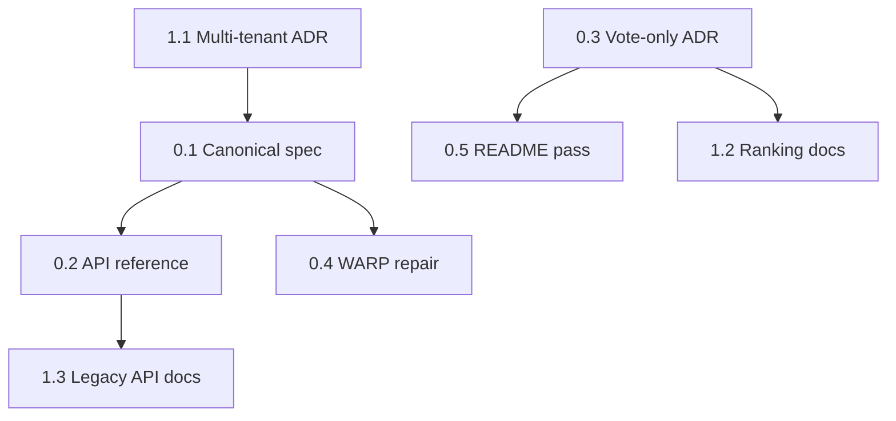

# Documentation & Architecture Alignment — Implementation Plan

**Program:** Align NARIMATO documentation and product claims with the running codebase (audit: May 2026).  
**App version:** 7.1.0 → target **7.2.0** when Phase 0 ships.  
**GitHub project:** [{narimato} - From IDEA to LIVE](https://github.com/users/moldovancsaba/projects/33)  
**Tracking:** GitHub issues labeled `doc-alignment` + milestone `Doc & Architecture Alignment`

**Issue quality bar:** Each deliverable issue follows the `{reply}` template ([example #120](https://github.com/moldovancsaba/reply/issues/120)): Objective, Unified Context, Problem, Goal, Scope (In/Out), Execution Prompt, Constraints, Acceptance Checks, Dependencies, Risks, Delivery Artifact, Developer Notes. Bodies are maintained in `scripts/issue-bodies/{issue}.md`.

## Decision log (locked)

| ADR | Decision | Date |
|-----|----------|------|
| [001](adr/001-vote-only-status.md) | **Vote-only supported** — 410/removal text was leftover | 2026-05-23 |
| [002](adr/002-multi-tenant-database.md) | **Per-org DB isolation** — service model for multiple orgs/projects | 2026-05-23 |

**Process:** One commit (and PR if used) per issue; push to `origin/main`. No external API consumers yet — `snake_case` mode normalization (#20) is safe when executed.

---

## Goals

1. **One canonical technical spec** that matches `lib/`, `pages/api/`, and `pages/play.js`.
2. **No false product claims** in README (dark mode, optimistic locking, theming, binary-search-as-primary).
3. **Explicit decisions** on vote-only and multi-tenant (implement vs document MVP).
4. **Repo hygiene** so audits are not confused by `* 2.js` duplicates.

---

## Phases & deliverables

### Phase 0 — Documentation truth baseline (P0, ~1–2 weeks)

| # | Deliverable | Outcome |
|---|-------------|---------|
| 0.1 | **Canonical spec** | `narimato_unified_documentation.md` updated to v7.1.0+; `ARCHITECTURE.md` aspirational sections moved to `docs/FUTURE.md` or removed |
| 0.2 | **API reference fix** | `docs/API_REFERENCE.md`: document `/api/cards*`, remove obsolete `cardName`/`playUuid`/`/api/v1/cards` spec |
| 0.3 | **Vote-only decision** | ADR + aligned README, RELEASE_NOTES, `/vote-only` page, and code |
| 0.4 | **WARP.md repair** | Correct Next.js version, `fieldNames` usage, remove `UUID_FIELDS` / `buildOrgMongoUri` fiction |
| 0.5 | **README honesty pass** | Remove or qualify: full dark mode, optimistic locking, org theming; document 7 play modes |

### Phase 1 — Architecture honesty (P1, ~2–3 weeks)

| # | Deliverable | Outcome |
|---|-------------|---------|
| 1.1 | **Multi-tenant ADR** | Either implement `buildOrgMongoUri` + org routing **or** document single-DB MVP and fix scripts |
| 1.2 | **Ranking algorithm docs** | Document `VoteOnlyService` as v1 vote path; binary search marked legacy/orphan or wired in |
| 1.3 | **Legacy API documentation** | `/api/play/*` documented as deprecated-but-active; client migration notes for `pages/play.js` |
| 1.4 | **API consistency** | `onboarding` in README; normalize `mode` strings in results (`snake_case` contract) |
| 1.5 | **Model inventory** | ARCHITECTURE model list matches `lib/models/` only |

### Phase 2 — Code hygiene & small fixes (P2, ~1 week)

| # | Deliverable | Outcome |
|---|-------------|---------|
| 2.1 | **Remove `* 2.js` duplicates** | Delete 35 unused copies after diff review |
| 2.2 | **Organization script alignment** | Scripts use same schema as `lib/models/Organization.js` |
| 2.3 | **Vote integrity** | Client 100ms debounce on vote taps (if kept in docs) |
| 2.4 | **API versioning parity** | `withApiVersion` on `start` + `input` or docs updated |

---

## Dependencies

---

## Definition of done (program)

- [ ] New contributor can follow **one doc** + README without hitting contradictions
- [ ] Every HTTP route in `pages/api/` is documented or explicitly marked deprecated
- [ ] No README feature without code path or “planned” label in `docs/FUTURE.md`
- [ ] GitHub project #33 has all deliverable issues with Status ≠ IDEABANK (except open ADRs)

---

## Issue index

See GitHub issues with label `doc-alignment` and milestone **Doc & Architecture Alignment**.
