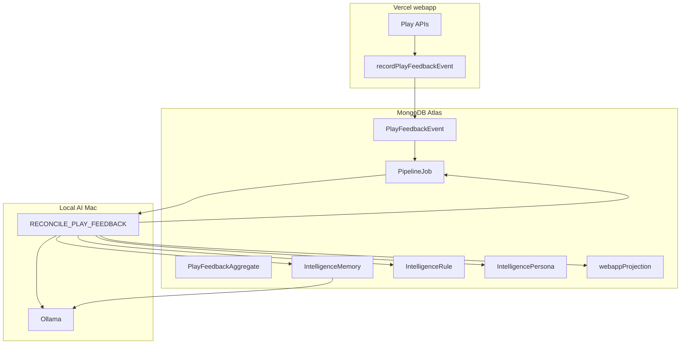

# Play feedback training — implementation plan

**Status:** Proposed (2026-05-24)  
**ADR:** [adr/005-play-feedback-training.md](./adr/005-play-feedback-training.md)  
**Schemas:** [PLAY_FEEDBACK_TRAINING_LLD.md](./PLAY_FEEDBACK_TRAINING_LLD.md)  
**Architecture baseline:** [adr/003-local-ai-dual-runtime.md](./adr/003-local-ai-dual-runtime.md)

## Goal

Close the intelligence loop:

**Webapp play (Atlas) → durable feedback events → local Mac workers → rules / memories / persona → refined generation prompts → updated cards + projection → webapp reads again**

The online webapp continues to work **without** the local AI server when `Card` / `webappProjection` already exist in Atlas ([ADR 003](./adr/003-local-ai-dual-runtime.md)). Training is **async** on the Mac.

## Current state

| Area | Today | Gap |
|------|--------|-----|
| Play completion | `enqueuePlayFeedbackReconciliation` in `pages/api/v1/play/[playId]/results.js` | Handler **stub**; flag **off** |
| Play data | `Play` / `SwipeOnlyPlay` with swipes, votes, `personalRanking` | No immutable **event** export |
| Training store | `TopicSpec.conversation`, `GlobalSetting` | No **memory / rule / persona** models |
| Generation | Static system prompt in `runTopicChat` | No play-derived **prompt context** |
| Operator feedback | `operatorFeedback` + `RECONCILE_FEEDBACK` | Editor-only, not participant scale |

## Target flow

## Design principles

1. **Append-only events** from the webapp; idempotent on `{ organizationId, playId }`.
2. **Scoped training data**: org → deck → optional `topicSpecId`; no cross-tenant leakage.
3. **Provenance** on every memory/rule: `playIds`, `jobId`, `source: play | operator | system`.
4. **HiTL default** for archive/regen; honor existing `DeckIntelligenceConfig.autoApprove`.
5. **Heavy training in jobs** via `queueAiInference` — never inline on play APIs.

---

## Phase 0 — Contract & wiring (1 week)

**Issues:** `#play-feedback-0-adr`, `#play-feedback-0-event`

### Deliverables

- [x] ADR 005 (this program’s architecture decision)
- [x] LLD schemas ([PLAY_FEEDBACK_TRAINING_LLD.md](./PLAY_FEEDBACK_TRAINING_LLD.md))
- [ ] `lib/models/PlayFeedbackEvent.js` + register in tenant models
- [ ] `lib/intelligence/playFeedbackRecorder.js`
- [ ] Wire recorder into play results completion (v1 + unified v1 API paths)
- [ ] Zod schema `lib/intelligence/playFeedbackSchema.js`
- [ ] Env keys in [INTELLIGENCE_ENV.example](./INTELLIGENCE_ENV.example)

### Env

| Variable | Default |
|----------|---------|
| `INTELLIGENCE_PLAY_FEEDBACK_ENABLED` | `0` |
| `PLAY_FEEDBACK_MIN_SESSION_CARDS` | `3` |
| `PLAY_FEEDBACK_RETENTION_DAYS` | `365` |
| `PLAY_FEEDBACK_RECONCILE_COOLDOWN_H` | `24` |

### Acceptance

- After one completed play, exactly one `PlayFeedbackEvent` in Atlas.
- Duplicate results fetch does not duplicate events.
- `npm run intelligence:e2e` asserts event row (extend script).

---

## Phase 1 — Signal extraction (2 weeks)

**Issue:** `#play-feedback-1-extract`

### Deliverables

- [ ] `lib/models/PlayFeedbackAggregate.js`
- [ ] `lib/intelligence/playFeedbackExtractor.js`
  - Inputs: event + `Play` + `Card` snapshots
  - Outputs: merge into aggregate (top/bottom cards, pairwise wins, swipe rates, confidence)
- [ ] `RECONCILE_PLAY_FEEDBACK` step 1: extract only (no LLM), unit tests with fixture events

### Signals

| Signal | Training use |
|--------|----------------|
| `personalRanking` | Preferred concepts |
| Swipe left/right | Reject / accept |
| Vote pairs | Relative strength |
| ELO at completion | Reinforce global ranking |
| Mode | Weight swipe vs vote |

### Acceptance

- Aggregate updates after reconcile step 1.
- Confidence stays low until `minSessionsBeforeTrain` (config).

---

## Phase 2 — Memory, rules, persona store (2–3 weeks)

**Issue:** `#play-feedback-2-models`

### Deliverables

- [ ] Master models: `IntelligenceMemory`, `IntelligenceRule`, `IntelligencePersona` ([LLD](./PLAY_FEEDBACK_TRAINING_LLD.md))
- [ ] `lib/db.js` registration + `getMaster*Model` helpers
- [ ] Operator API (local only):
  - `GET /api/intelligence/memory`
  - `GET /api/intelligence/rules`
  - `GET /api/intelligence/persona`
  - `POST` approve/dismiss proposed items (HiTL)
- [ ] Extend `DeckIntelligenceConfig` schema per LLD

### Acceptance

- CRUD from operator console (read-only list in v2a; approve in v2b).
- Memories store `playIds` provenance.

---

## Phase 3 — `RECONCILE_PLAY_FEEDBACK` implementation (3 weeks)

**Issue:** `#play-feedback-3-reconcile`

### Handler pipeline (`lib/intelligence/playFeedbackReconcile.js`)

| Step | Action |
|------|--------|
| 1 | Load event; skip if `reconciledAt` or below `PLAY_FEEDBACK_MIN_SESSION_CARDS` |
| 2 | `playFeedbackExtractor.mergeAggregate` |
| 3 | Resolve `topicSpecId` from `deckRootTag` (or create draft `TopicSpec`) |
| 4 | Build training bundle JSON |
| 5 | Ollama structured output ([LLD](./PLAY_FEEDBACK_TRAINING_LLD.md)) |
| 6 | Persist proposed memories/rules; apply persona deltas (new version) |
| 7 | Append `topicSpecConversationEntry` to `TopicSpec.conversation` |
| 8 | Map `contentActions` → existing jobs (`REGENERATE_TAG`, `APPEND_CARDS`, archive) |
| 9 | Enqueue `REFRESH_PROJECTION`; set `reconciledAt` on event |

### Replace stub

- [ ] `lib/intelligence/jobHandlers.js` — real `RECONCILE_PLAY_FEEDBACK` branch
- [ ] Cooldown: skip enqueue if job completed for `playId` within `PLAY_FEEDBACK_RECONCILE_COOLDOWN_H`

### Acceptance

- With `INTELLIGENCE_PLAY_FEEDBACK_ENABLED=1` and `OLLAMA_SKIP=1` fixture path, handler completes and writes ≥1 memory.
- E2E: play → event → job completed → memory exists.

---

## Phase 4 — Prompt injection (“heavy training” in generation) (2–3 weeks)

**Issue:** `#play-feedback-4-prompts`

### Deliverables

- [ ] `lib/intelligence/promptContext.js` — `buildGenerationContext()`
- [ ] Inject into `runTopicChat` (`jobHandlers.js`)
- [ ] Inject into `GENERATE_DECK_CARDS` / `PLAN_DECK` prompts
- [ ] New job `DISTILL_PLAY_MEMORIES` (batch, no play session required)
- [ ] New job `TRAIN_PERSONA_FROM_PLAY` (batch when `sessionCount >= minSessionsBeforeTrain`)

### Acceptance

- Generated cards in fixture E2E reflect a seeded memory string in prompt (assert log or snapshot field `generationContextHash` optional).

---

## Phase 5 — Operator UX (2 weeks)

**Issue:** `#play-feedback-5-ui`

### Deliverables

- [ ] Operator tab **Play learnings** in `LocalOperatorConsole` or dedicated panel
  - Recent events, aggregates, pending memories/rules
  - Approve / dismiss / “Apply regen”
  - Persona version history
- [ ] Status API: `playFeedback: { enabled, pendingJobs, lastReconcileAt }`

### Acceptance

- Operator can block auto-actions before regen runs.

---

## Phase 6 — Content refinement & re-vote (3 weeks)

**Issue:** `#play-feedback-6-refine`

Implements [ADR 004](./adr/004-intelligence-product-policy.md) deferred items.

| Trigger | Action |
|---------|--------|
| Card in `bottomCardUuids` for M sessions | Propose `archive_card` |
| Strong theme in `topCardUuids` | Propose `append_cards` |
| Deck material changed after play | Mark plays `staleDeckVersion`; operator alert |
| Any card mutation | `REFRESH_PROJECTION` |

Participant re-vote UX remains **out of scope** for v2 unless product approves (email / “deck updated” banner).

---

## Phase 7 — Hardening (1–2 weeks)

**Issue:** `#play-feedback-7-hardening`

- [ ] Retention purge job for old events
- [ ] Rate limits on enqueue + reconcile
- [ ] `npm run intelligence:ci-guard` — no new Ollama imports under `pages/`
- [ ] Document GDPR posture in ADR 005 (done) + runbook in this file

---

## GitHub issue checklist

Copy into GitHub when ready:

| ID | Title |
|----|--------|
| A | ADR 005 + PLAY_FEEDBACK LLD + plan (docs only) |
| B | PlayFeedbackEvent model + webapp recorder |
| C | PlayFeedbackAggregate + extractor |
| D | IntelligenceMemory / Rule / Persona models + API |
| E | Implement RECONCILE_PLAY_FEEDBACK |
| F | promptContext + generation injection |
| G | DISTILL_PLAY_MEMORIES + TRAIN_PERSONA_FROM_PLAY |
| H | Operator Play learnings UI |
| I | Play-driven content actions + E2E extension |

---

## MVP milestone (recommended first ship)

**Phases 0–3 + partial 4** (~8–10 weeks):

1. Record `PlayFeedbackEvent` on every completed session.
2. Real reconcile → **distilled memories** + `TopicSpec` audit entry.
3. Inject top memories into **next** `GENERATE_DECK_CARDS` for that deck.
4. Operator approves before auto-archive/regen.

Delivers: *participant interactions push back into local AI and improve the next content generation* without waiting for batch persona training or re-vote UI.

---

## Timeline (sequential estimate)

| Phases | Calendar |
|--------|----------|
| 0 | 1 week |
| 1 | 2 weeks |
| 2 | 2–3 weeks |
| 3 | 3 weeks |
| 4 | 2–3 weeks |
| 5 | 2 weeks |
| 6 | 3 weeks |
| 7 | 1–2 weeks |
| **Total** | **~14–18 weeks** |

Phases 5–7 can overlap with 4 if staffed.

---

## What does not change

- Vercel **read-only** intelligence (projection + card fallback).
- Local Mac **required** for new AI content and all training execution.
- `webappProjection` remains the webapp read contract ([WEBAPP_READ_MODEL_LLD.md](./WEBAPP_READ_MODEL_LLD.md)).

---

## Doc maintenance

When implementation starts, update:

- [NARIMATO_INTELLIGENCE_SSOT.md](./NARIMATO_INTELLIGENCE_SSOT.md) — code map + model list
- [LOCAL_AI_PIPELINE.md](./LOCAL_AI_PIPELINE.md) — job catalog v2
- [adr/004-intelligence-product-policy.md](./adr/004-intelligence-product-policy.md) — move deferred items to “implemented via ADR 005” when done
